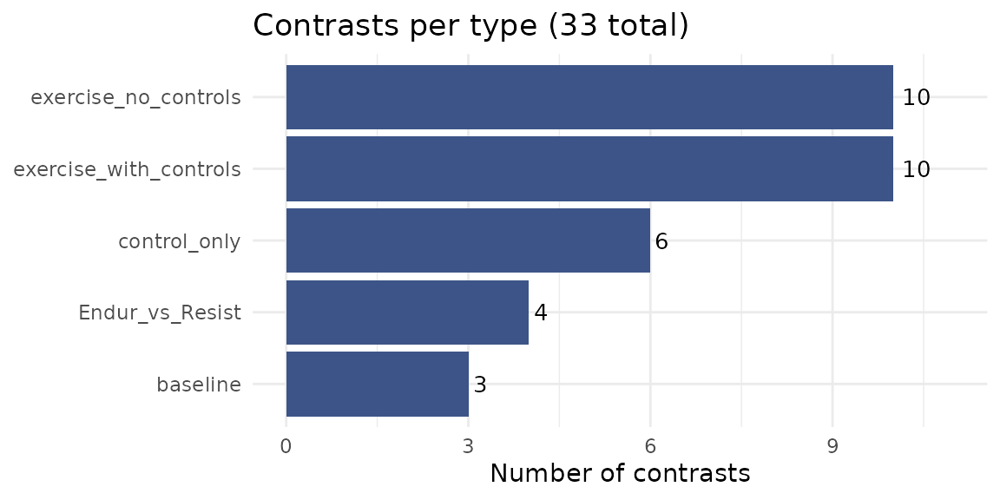
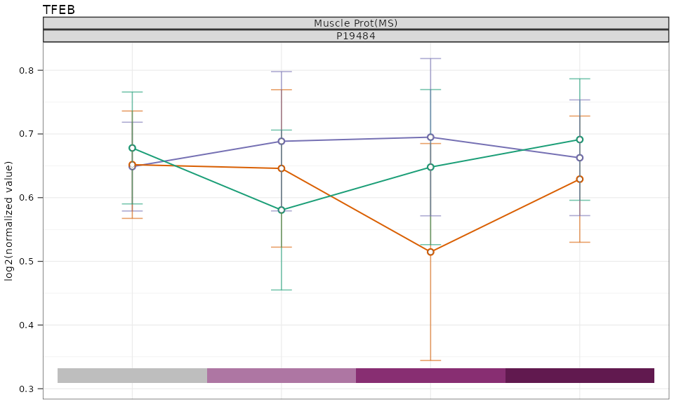

# MotrpacHumanPreSuspensionAnalysis: Complete Package Overview

``` r

library(MotrpacHumanPreSuspensionAnalysis)
#> Warning: no DISPLAY variable so Tk is not available
```

------------------------------------------------------------------------

## Introduction

`MotrpacHumanPreSuspensionAnalysis` is an R package that distributes
summary-level results from the MoTrPAC Human Pre-COVID sedentary adult
exercise study. It provides a unified interface for loading, exploring,
and analyzing differential abundance results across multiple molecular
assays (“omes”) and tissues, along with tools for gene set enrichment
analysis, fuzzy c-means clustering, and publication-quality
visualization.

**Important:** This package distributes summary-level results only.
Subject-level data are not included and must be requested separately
through [MoTrPAC data access
procedures](https://motrpac-data.org/project-overview#acute-exercise).

### Study design overview

The study examined acute exercise responses across three tissues
(adipose, blood, and muscle) in sedentary adults randomized to endurance
exercise (EE), resistance exercise (RE), or control (CON) groups.
Samples were collected at multiple timepoints relative to a single bout
of exercise:

- Pre-exercise (baseline)
- During exercise (20 min, 40 min)
- Post-exercise (10 min, 15/30/45 min, 3.5/4 hr, 24 hr)

Molecular profiling spanned seven assay types:

- Transcriptomics (RNA-seq)
- Global proteomics (prot-pr)
- Phosphoproteomics (prot-ph)
- Olink proteomics (prot-ol)
- Metabolomics (14 targeted and untargeted platforms)
- ATAC-seq (epigen-atac-seq)
- MethylCap-seq (epigen-methylcap-seq)

There are also key clinical values

------------------------------------------------------------------------

## 1. Available Tissues and Omes

Before loading any data, you can check which tissues and omes are
available.

``` r

tissue_available_list()
#> The available tissues are placed into overarching categories. For example, an assay using PBMCs would be categorized as blood.
#> [1] "adipose" "blood"   "muscle"
```

``` r

ome_available_list()
#>  [1] "prot-ol"              "prot-ph"              "prot-pr"             
#>  [4] "transcript-rna-seq"   "epigen-methylcap-seq" "epigen-atac-seq"     
#>  [7] "metab-u-hilicpos"     "metab-u-ionpneg"      "metab-u-lrpneg"      
#> [10] "metab-u-lrppos"       "metab-u-rpneg"        "metab-u-rppos"       
#> [13] "metab-t-amines"       "metab-t-conv"         "metab-t-imm-crt"     
#> [16] "metab-t-oxylipneg"    "metab-t-tca"          "metab-t-nuc"         
#> [19] "metab-t-acoa"         "metab-t-ka"           "metab-meta-reg"
```

To see only the metabolomics platforms:

``` r

metab_only_list()
#>  [1] "metab-u-hilicpos"  "metab-u-ionpneg"   "metab-u-lrpneg"   
#>  [4] "metab-u-lrppos"    "metab-u-rpneg"     "metab-u-rppos"    
#>  [7] "metab-t-amines"    "metab-t-conv"      "metab-t-imm-crt"  
#> [10] "metab-t-oxylipneg" "metab-t-tca"       "metab-t-nuc"      
#> [13] "metab-t-acoa"      "metab-t-ka"
```

------------------------------------------------------------------------

## 2. Data Objects

The package ships with a variety of lazily loaded data objects. These
objects are the backbone of most functions in the package.

### 2.1 Differential Analysis Results

The core DA results are stored as internal data objects (e.g.,
`MUSCLE_PROT_PR_DA`, `BLOOD_TRNSCRPT_DA`). These should **not** be
accessed directly. Instead, use the
[`load_differential_analysis()`](https://motrpac.github.io/MotrpacHumanPreSuspensionAnalysis/reference/load_differential_analysis.md)
function described below.

### 2.2 Summary Statistics

Group-level means and standard deviations for normalized expression data
are stored as `*_SUM_STATS` objects (e.g., `MUSCLE_PROT_PR_SUM_STATS`).
Use
[`load_summary_stats()`](https://motrpac.github.io/MotrpacHumanPreSuspensionAnalysis/reference/load_summary_stats.md)
to access these.

### 2.3 Contrast Converter

The `CONTRAST_CONVERTER` table maps all **33 contrasts** used in
differential analysis to their short names, types, and categories.
Understanding the contrast structure is essential for correctly
interpreting results.

For a graphical overview of the study design and timepoints, see the
[MoTrPAC Acute Exercise Study
Design](https://motrpac-data.org/project-overview#acute-exercise).

``` r

head(CONTRAST_CONVERTER)
#>    contrast_order
#>             <int>
#> 1:              1
#> 2:              2
#> 3:              3
#> 4:              4
#> 5:              5
#> 6:              6
#>                                                                                                                                                                   contrast
#>                                                                                                                                                                     <fctr>
#> 1:         group_timepointADUEndur.during_20_min - group_timepointADUEndur.pre_exercise - group_timepointADUControl.during_20_min + group_timepointADUControl.pre_exercise
#> 2:         group_timepointADUEndur.during_40_min - group_timepointADUEndur.pre_exercise - group_timepointADUControl.during_40_min + group_timepointADUControl.pre_exercise
#> 3:             group_timepointADUEndur.post_10_min - group_timepointADUEndur.pre_exercise - group_timepointADUControl.post_10_min + group_timepointADUControl.pre_exercise
#> 4: group_timepointADUEndur.post_15_30_45_min - group_timepointADUEndur.pre_exercise - group_timepointADUControl.post_15_30_45_min + group_timepointADUControl.pre_exercise
#> 5:         group_timepointADUEndur.post_3.5_4_hr - group_timepointADUEndur.pre_exercise - group_timepointADUControl.post_3.5_4_hr + group_timepointADUControl.pre_exercise
#> 6:               group_timepointADUEndur.post_24_hr - group_timepointADUEndur.pre_exercise - group_timepointADUControl.post_24_hr + group_timepointADUControl.pre_exercise
#>                                                       contrast_short
#>                                                               <fctr>
#> 1:         Endur.during_20_min - Control.during_20_min (delta-delta)
#> 2:         Endur.during_40_min - Control.during_40_min (delta-delta)
#> 3:             Endur.post_10_min - Control.post_10_min (delta-delta)
#> 4: Endur.post_15_30_45_min - Control.post_15_30_45_min (delta-delta)
#> 5:         Endur.post_3.5_4_hr - Control.post_3.5_4_hr (delta-delta)
#> 6:               Endur.post_24_hr - Control.post_24_hr (delta-delta)
#>             contrast_type contrast_category randomGroupCode         Timepoint
#>                    <fctr>            <fctr>          <char>            <fctr>
#> 1: exercise_with_controls            EE-CON        ADUEndur     during_20_min
#> 2: exercise_with_controls            EE-CON        ADUEndur     during_40_min
#> 3: exercise_with_controls            EE-CON        ADUEndur       post_10_min
#> 4: exercise_with_controls            EE-CON        ADUEndur post_15_30_45_min
#> 5: exercise_with_controls            EE-CON        ADUEndur     post_3.5_4_hr
#> 6: exercise_with_controls            EE-CON        ADUEndur        post_24_hr
```

#### Contrast types

The 33 contrasts are organized into five types, each addressing a
different biological question:

- **`exercise_with_controls`** (10 contrasts) — The primary analysis.
  Compares each exercise group (Endurance or Resistance) to time-matched
  controls using a delta-delta design: (exercise post - exercise pre) -
  (control post - control pre). This removes baseline differences and
  isolates the exercise-specific response.

- **`exercise_no_controls`** (10 contrasts) — Within-group change from
  baseline for each exercise group (post - pre), without adjusting for
  control group changes. These are purely for comparison to describe the
  effect of the controls. These are not presented as a main result in
  the manuscript.

- **`Endur_vs_Resist`** (4 contrasts) — Direct comparison of endurance
  vs. resistance exercise at each post-exercise timepoint (delta-delta
  design). Identifies modality-differing responses.

- **`baseline`** (3 contrasts) — Pre-exercise differences between groups
  (Endurance vs. Resistance, Endurance vs. Control, Resistance vs.
  Control). Verifies randomization and identifies pre-existing group
  differences. Also evaluates the potential effect of the
  familiarization protocol.

- **`control_only`** (6 contrasts) — Control group changes over time
  relative to their own pre-exercise baseline. Captures effects of
  fasting, biopsy, or circadian variation unrelated to exercise.

#### Available contrasts by type

``` r

# Number of contrasts per type
contrast_counts <- as.data.frame(table(CONTRAST_CONVERTER$contrast_type))
colnames(contrast_counts) <- c("contrast_type", "n")

ggplot2::ggplot(contrast_counts,
                ggplot2::aes(x = reorder(contrast_type, n), y = n)) +
  ggplot2::geom_col(fill = "#3C5488") +
  ggplot2::geom_text(ggplot2::aes(label = n), hjust = -0.3, size = 3.5) +
  ggplot2::coord_flip() +
  ggplot2::labs(x = NULL, y = "Number of contrasts",
                title = "Contrasts per type (33 total)") +
  ggplot2::theme_minimal() +
  ggplot2::ylim(0, max(contrast_counts$n) + 1)
```



``` r

# Show the short contrast names grouped by type
for (ct in unique(CONTRAST_CONVERTER$contrast_type)) {
  cat("**", ct, "**\n\n", sep = "")
  shorts <- CONTRAST_CONVERTER$contrast_short[CONTRAST_CONVERTER$contrast_type == ct]
  for (s in shorts) cat("-", as.character(s), "\n")
  cat("\n")
}
```

**exercise_with_controls**

- Endur.during_20_min - Control.during_20_min (delta-delta)
- Endur.during_40_min - Control.during_40_min (delta-delta)
- Endur.post_10_min - Control.post_10_min (delta-delta)
- Endur.post_15_30_45_min - Control.post_15_30_45_min (delta-delta)
- Endur.post_3.5_4_hr - Control.post_3.5_4_hr (delta-delta)
- Endur.post_24_hr - Control.post_24_hr (delta-delta)
- Resist.post_10_min - Control.post_10_min (delta-delta)
- Resist.post_15_30_45_min - Control.post_15_30_45_min (delta-delta)
- Resist.post_3.5_4_hr - Control.post_3.5_4_hr (delta-delta)
- Resist.post_24_hr - Control.post_24_hr (delta-delta)

**exercise_no_controls**

- Endur.during_20_min - Endur.pre_exercise
- Endur.during_40_min - Endur.pre_exercise
- Endur.post_10_min - Endur.pre_exercise
- Endur.post_15_30_45_min - Endur.pre_exercise
- Endur.post_3.5_4_hr - Endur.pre_exercise
- Endur.post_24_hr - Endur.pre_exercise
- Resist.post_10_min - Resist.pre_exercise
- Resist.post_15_30_45_min - Resist.pre_exercise
- Resist.post_3.5_4_hr - Resist.pre_exercise
- Resist.post_24_hr - Resist.pre_exercise

**Endur_vs_Resist**

- Endur.post_10_min - Resist.post_10_min (delta-delta)
- Endur.post_15_30_45_min - Resist.post_15_30_45_min (delta-delta)
- Endur.post_3.5_4_hr - Resist.post_3.5_4_hr (delta-delta)
- Endur.post_24_hr - Resist.post_24_hr (delta-delta)

**baseline**

- Endur.pre_exercise - Resist.pre_exercise
- Endur.pre_exercise - Control.pre_exercise
- Resist.pre_exercise - Control.pre_exercise

**control_only**

- Control.during_20_min - Control.pre_exercise
- Control.during_40_min - Control.pre_exercise
- Control.post_10_min - Control.pre_exercise
- Control.post_15_30_45_min - Control.pre_exercise
- Control.post_3.5_4_hr - Control.pre_exercise
- Control.post_24_hr - Control.pre_exercise

Most downstream analyses focus on `exercise_with_controls`. Make sure to
filter by `contrast_type` before interpreting results:

``` r

DA <- load_differential_analysis(single_matrix = TRUE)

# Keep only the primary exercise-vs-control contrasts
DA_primary <- DA[DA$contrast_type == "exercise_with_controls", ]
```

### 2.4 Feature-to-Gene Mapping

`HUMAN_FEATURE_TO_GENE` is a large lookup table (~1.96M rows) that maps
feature IDs to gene symbols, Entrez IDs, Ensembl IDs, UniProt IDs,
RefMet names, KEGG IDs, and flanking sequences (for phosphoproteomics).

``` r

str(HUMAN_FEATURE_TO_GENE[1:5, ])
```

which should print:

    Classes ‘data.table’ and 'data.frame':  5 obs. of  11 variables:
     $ assay               : Factor w/ 7 levels "epigen-atac-seq",..: 1 1 1 1 1
     $ feature_id          : Factor w/ 1958568 levels "(E,E)-Trichostachine",..: 793 794 795 796 797
     $ entrez_gene         : Factor w/ 23406 levels "1","10","100",..: 8521 8521 4916 8521 8521
     $ gene_symbol         : Factor w/ 32911 levels "5_8S_rRNA","5S_rRNA",..: 27108 27108 22521 27108 27108
     $ ensembl_gene        : Factor w/ 50007 levels "ENSG00000000003",..: 4704 4704 10604 4704 4704
     $ custom_annotation   : Factor w/ 10 levels "3' UTR","5' UTR",..: 6 5 6 6 6
     $ relationship_to_gene: num  0 0 0 0 0
     $ uniprot             : Factor w/ 10736 levels "A0A075B6H7","A0A075B6H8",..: NA NA NA NA NA
     $ refmet_name         : Factor w/ 1513 levels "(E,E)-Trichostachine",..: NA NA NA NA NA
     $ kegg_id             : Factor w/ 392 levels "C00002","C00003",..: NA NA NA NA NA
     $ flanking_sequence   : Factor w/ 30682 levels "------MsDEEVEQV",..: NA NA NA NA NA
     - attr(*, ".internal.selfref")=<externalptr> 
     - attr(*, "sorted")= chr [1:2] "assay" "feature_id"

### 2.5 Metabolomics CVs

`METABOLOMICS_CVS` contains coefficients of variation for metabolomics
features, used internally to select the lowest-CV feature when multiple
features map to the same RefMet metabolite.

``` r

head(METABOLOMICS_CVS)
#> # A tibble: 6 × 9
#>   tissue_assay_sites   tissue_code assay site  feature_id feature_cv refmet_name
#>   <chr>                <chr>       <chr> <chr> <chr>           <dbl> <fct>      
#> 1 t02-plasma,metab-t-… t02-plasma  meta… mayo  1-Methylh…      10.5  1-Methylhi…
#> 2 t02-plasma,metab-t-… t02-plasma  meta… mayo  3-Methylh…      18.2  3-Methylhi…
#> 3 t02-plasma,metab-t-… t02-plasma  meta… mayo  Alanine          5.73 Alanine    
#> 4 t02-plasma,metab-t-… t02-plasma  meta… mayo  alpha-Ami…       6.75 Aminoadipi…
#> 5 t02-plasma,metab-t-… t02-plasma  meta… mayo  alpha-Ami…      11.9  2-Aminobut…
#> 6 t02-plasma,metab-t-… t02-plasma  meta… mayo  Arginine        11.6  Arginine   
#> # ℹ 2 more variables: tissue <chr>, lowest_CV <chr>
```

### 2.6 Molecular Signatures

`MOLECULAR_SIGNATURES` is a named list of gene set databases used for
enrichment analysis. Available databases include:

``` r

names(MOLECULAR_SIGNATURES)
#>  [1] "BIOCARTA"     "KEGG_MEDICUS" "PID"          "REACTOME"     "WP"          
#>  [6] "GOBP"         "GOCC"         "GOMF"         "MITOCARTA"    "PSP"         
#> [11] "REFMET"       "PTMSIGDB"     "CELLMARKER"
```

These include canonical pathway databases (BIOCARTA, KEGG_MEDICUS, PID,
REACTOME, WikiPathways), Gene Ontology collections (GOBP, GOCC, GOMF),
MitoCarta3.0, PhosphoSitePlus kinase substrates (PSP), RefMet chemical
subclasses (REFMET), PTMSigDB, and CellMarker.

### 2.7 SET_TO_ID

`SET_TO_ID` maps each molecular signature to a unique numeric ID and
shortened name for use in figures and enrichment analyses.

``` r

head(SET_TO_ID)
#>   collection database set_id                            set
#> 1         C2 BIOCARTA  00001          BIOCARTA_41BB_PATHWAY
#> 2         C2 BIOCARTA  00002          BIOCARTA_ACE2_PATHWAY
#> 3         C2 BIOCARTA  00003 BIOCARTA_ACETAMINOPHEN_PATHWAY
#> 4         C2 BIOCARTA  00004           BIOCARTA_ACH_PATHWAY
#> 5         C2 BIOCARTA  00005        BIOCARTA_ACTINY_PATHWAY
#> 6         C2 BIOCARTA  00006         BIOCARTA_AGPCR_PATHWAY
#>                        set_short
#> 1          BIOCARTA_41BB_PATHWAY
#> 2          BIOCARTA_ACE2_PATHWAY
#> 3 BIOCARTA_ACETAMINOPHEN_PATHWAY
#> 4           BIOCARTA_ACH_PATHWAY
#> 5        BIOCARTA_ACTINY_PATHWAY
#> 6         BIOCARTA_AGPCR_PATHWAY
```

### 2.8 Pre-computed Enrichment and Clustering Results

The package includes pre-computed results for convenience:

- `CAMERA_RESULTS` — CAMERA-PR enrichment results across all tissues and
  omes
- `FCM_CLUSTERS` — Fuzzy c-means clustering assignments
- `FCM_CAMERA` — Cluster-level CAMERA enrichment results
- `FCM_ORA` — Cluster-level over-representation analysis results

### 2.9 Other Data Objects

- `COVARIATES_FILE` — covariates used in differential modeling
- `OUTLIERS` — flagged outlier samples from QC review
- `UTORONTO_TFs` — curated human transcription factor list (Lambert et
  al.)
- `OME_TISSUE_CODE` — tissue codes for each ome
- `SPLICING_DA` — significant differential alternative splicing results
  (FDR \< 0.05)

#### Color and Annotation Objects

For consistent figure styling, the package provides named color vectors:

- `HUMAN_TISSUE_COLORS` — tissue colors
- `HUMAN_EXERCISE_GROUP_COLORS` — exercise group colors (EE, RE, CON)
- `HUMAN_ACUTE_TIMEPOINT_COLORS` — timepoint phase colors
- `HUMAN_OME_COLORS` — molecular modality colors
- `HUMAN_SEX_COLORS` — sex-based colors
- `HUMAN_TISSUE_ABBR` — tissue abbreviations

------------------------------------------------------------------------

## 3. Loading Differential Analysis Results

The primary entry point for accessing DA results is
[`load_differential_analysis()`](https://motrpac.github.io/MotrpacHumanPreSuspensionAnalysis/reference/load_differential_analysis.md).

### 3.1 Load all results

``` r

DA_list <- load_differential_analysis()
#> You've requested one or more epigenetic omes (via explicit selection or "all") but `epigen = FALSE`, so epigenetic data will be skipped. Set `epigen = TRUE` to load epigenetic data.
#> Please remember that the lowest CV Metabolite is chosen and the
#>             relevant refmet name is used. If you're not able to find your desired
#>             metabolite, look through the METABOLOMICS_CV object for the relevant
#>             refmet/feature name.
```

This returns a nested list organized by tissue (top level) and ome
(second level):

``` r

names(DA_list)
#> [1] "adipose" "blood"   "muscle"
lapply(DA_list, names)
#> $adipose
#> [1] "metab"              "prot-ph"            "prot-pr"           
#> [4] "transcript-rna-seq"
#> 
#> $blood
#> [1] "metab"              "prot-ol"            "transcript-rna-seq"
#> 
#> $muscle
#> [1] "metab"              "prot-ph"            "prot-pr"           
#> [4] "transcript-rna-seq"
```

Each element is a `data.table` with standardized columns including
`tissue`, `assay`, `contrast`, `contrast_type`, `feature_id`, `logFC`,
`z.std`, `p_value`, `adj_p_value`, and more.

``` r

str(DA_list[["muscle"]][["prot-pr"]])
#> Classes 'data.table' and 'data.frame':   130137 obs. of  20 variables:
#>  $ tissue            : chr  "muscle" "muscle" "muscle" "muscle" ...
#>  $ assay             : chr  "prot-pr" "prot-pr" "prot-pr" "prot-pr" ...
#>  $ full_model        : Factor w/ 1 level "~ 0 + group_timepoint +  BMI + calculatedAge + Sex + (1 | pid)": 1 1 1 1 1 1 1 1 1 1 ...
#>  $ contrast          : Factor w/ 21 levels "group_timepointADUEndur.post_15_30_45_min - group_timepointADUEndur.pre_exercise - group_timepointADUControl.po"| __truncated__,..: 1 1 1 1 1 1 1 1 1 1 ...
#>  $ contrast_short    : Factor w/ 33 levels "Endur.during_20_min - Control.during_20_min (delta-delta)",..: 4 4 4 4 4 4 4 4 4 4 ...
#>  $ contrast_type     : Factor w/ 5 levels "exercise_with_controls",..: 1 1 1 1 1 1 1 1 1 1 ...
#>  $ contrast_category : Factor w/ 6 levels "EE-CON","RE-CON",..: 1 1 1 1 1 1 1 1 1 1 ...
#>  $ randomGroupCode   : chr  "ADUEndur" "ADUEndur" "ADUEndur" "ADUEndur" ...
#>  $ Timepoint         : Factor w/ 7 levels "pre_exercise",..: 5 5 5 5 5 5 5 5 5 5 ...
#>  $ feature_id        : chr  "P46976-2" "Q9H3M7" "Q9NW81" "Q9Y3B4" ...
#>  $ logFC             : num  0.419 -0.412 -0.327 0.138 0.346 ...
#>  $ CI.L              : num  0.278 -0.6027 -0.5251 0.0533 0.1326 ...
#>  $ CI.R              : num  0.56 -0.222 -0.13 0.223 0.56 ...
#>  $ degrees_of_freedom: num  293 248 203 126 116 ...
#>  $ logLik            : num  -310 -371 -414 -326 -295 ...
#>  $ t                 : num  5.86 -4.27 -3.27 3.21 3.21 ...
#>  $ AveExpr           : num  0.404 -0.785 0.471 -0.359 -0.404 ...
#>  $ z.std             : num  5.66 -4.19 -3.21 3.17 3.14 ...
#>  $ p_value           : num  1.55e-08 2.74e-05 1.32e-03 1.50e-03 1.72e-03 ...
#>  $ adj_p_value       : num  9.62e-05 8.50e-02 1.00 1.00 1.00 ...
#>  - attr(*, ".internal.selfref")=<pointer: (nil)> 
#>  - attr(*, "sorted")= chr [1:4] "full_model" "contrast" "p_value" "feature_id"
```

### 3.2 Filter by tissue and ome

``` r

DA_muscle_rna <- load_differential_analysis(
  selected_tissues = "muscle",
  selected_omes = "transcript-rna-seq"
)
```

### 3.3 Return a single matrix

For analyses that prefer a flat data frame:

``` r

DA_matrix <- load_differential_analysis(single_matrix = TRUE)
#> You've requested one or more epigenetic omes (via explicit selection or "all") but `epigen = FALSE`, so epigenetic data will be skipped. Set `epigen = TRUE` to load epigenetic data.
#> Please remember that the lowest CV Metabolite is chosen and the
#>             relevant refmet name is used. If you're not able to find your desired
#>             metabolite, look through the METABOLOMICS_CV object for the relevant
#>             refmet/feature name.
dim(DA_matrix)
#> [1] 2212065      21
```

### 3.4 Include gene annotations

Merge DA results with `HUMAN_FEATURE_TO_GENE` in one step:

``` r

DA_annotated <- load_differential_analysis(
  selected_tissues = "muscle",
  selected_omes = "prot-pr",
  combine_with_featgene = TRUE
)
colnames(DA_annotated[["muscle"]][["prot-pr"]])
#>  [1] "tissue"             "assay"              "full_model"        
#>  [4] "contrast"           "contrast_short"     "contrast_type"     
#>  [7] "contrast_category"  "randomGroupCode"    "Timepoint"         
#> [10] "feature_id"         "entrez_gene"        "gene_symbol"       
#> [13] "ensembl_gene"       "uniprot"            "logFC"             
#> [16] "CI.L"               "CI.R"               "degrees_of_freedom"
#> [19] "logLik"             "t"                  "AveExpr"           
#> [22] "z.std"              "p_value"            "adj_p_value"
```

### 3.5 Epigenomics data

Epigenomics results are not bundled with the package due to file size.
Setting `epigen = TRUE` downloads them from AWS:

``` r

DA_list <- load_differential_analysis(epigen = TRUE)
```

This requires network access and can take 30+ minutes for the initial
download.

### 3.6 Metabolomics handling

When any metabolomics platform is selected, all metabolomics data are
loaded to enable consistent platform-level filtering. Redundant features
mapping to the same RefMet metabolite are resolved by selecting the
lowest-CV feature, and p-values are recalculated within contrasts. If a
metabolite of interest appears missing, consult `METABOLOMICS_CVS`.

### 3.7 Splicing data

Differential alternative splicing results (FDR \< 0.05 only) are
available directly:

``` r

names(SPLICING_DA)
#> [1] "adipose" "blood"   "muscle"
```

------------------------------------------------------------------------

## 4. Loading Summary Statistics

[`load_summary_stats()`](https://motrpac.github.io/MotrpacHumanPreSuspensionAnalysis/reference/load_summary_stats.md)
loads group-level means and standard deviations for normalized
expression data.

``` r

## Load all summary statistics
sum_stats <- load_summary_stats()

## Load metabolomics only
metab_stats <- load_summary_stats(selected_omes = "metab")

## Load as a single combined table
adipose_rna <- load_summary_stats(
  selected_tissues = "adipose",
  selected_omes = "transcript-rna-seq",
  single_matrix = TRUE
)
```

The interface mirrors
[`load_differential_analysis()`](https://motrpac.github.io/MotrpacHumanPreSuspensionAnalysis/reference/load_differential_analysis.md)
with `selected_tissues`, `selected_omes`, and `single_matrix`
parameters.

------------------------------------------------------------------------

## 5. Visualization

The package provides several plotting functions for both individual
features and pathway-level results.

### 5.1 Single Feature Plots

[`plot_single_feature()`](https://motrpac.github.io/MotrpacHumanPreSuspensionAnalysis/reference/plot_single_feature.md)
creates time-course line plots for a given feature, gene, or metabolite
across tissues and omes. Points are highlighted when the adjusted
p-value falls below a threshold.

``` r

# Returns a ggplot object that displays inline.
# Use the optional output_file parameter to save to PDF.
plot_single_feature(
  feature = "TFEB",
  selected_tissues = "muscle",
  selected_omes = "prot-pr",
  p_level = 0.05,
  color_time_labels = TRUE,
  include_legend = FALSE
)
#> DA is loaded automatically using requested settings.
#>               If any metab platform was requested, the metab features will default to
#>               any metabolomics platform measured.
#> Scale for fill is already present.
#> Adding another scale for fill, which will replace the existing scale.
#> Saved plot not requested or multi-faceted plot detected.
#>               Will not automatically save a plot. Please save plot manually.
#>               Recommended height per plot is 1.54 inches, and recommended width per plot
#>               of 1.225 inches with scale_factor set to 1.
#>               Use width of 1.715 if a right hand legend is desired
```



Key parameters:

- `feature` — a feature_id, gene_symbol, or refmet_name
  (case-insensitive)
- `p_level` — adjusted p-value threshold; significant points are filled
  black
- `color_time_labels` — replaces x-axis text with colored tiles
  (single-panel only)
- `scale_factor` — scales all plot elements proportionally for
  posters/presentations
- `output_file` — optional path to save (recommended single-panel
  dimensions: H=1.54in, W=1.225in at scale_factor=1)

### 5.2 Feature Heatmaps

[`plot_feature_heatmap()`](https://motrpac.github.io/MotrpacHumanPreSuspensionAnalysis/reference/plot_feature_heatmap.md)
generates a ComplexHeatmap for a set of features or a molecular
signature pathway, showing z-scores across contrasts.

``` r

# Note: filename is required — the heatmap is saved directly to PDF.
# Heatmap from a specific pathway (using set_id from SET_TO_ID)
plot_feature_heatmap(
    feature_ids = c("ENSG00000006210.7", "ENSG00000176907.5"),
    selected_tissue = "muscle",
    selected_ome = "transcript-rna-seq",
    filename = "custom_feature_heatmap.pdf"
)

plot_feature_heatmap(
    set_id = "00001",
    selected_tissue = "muscle",
    selected_ome = "prot-ph",
    contrast_type = "exercise_with_controls",
    filename = "feature_heatmap_example.pdf"
)
```

Key parameters:

- `feature_ids` — character vector of feature IDs for the heatmap rows
- `set_id` — alternatively, a pathway ID from `SET_TO_ID` (overrides
  `feature_ids`)
- `selected_tissue` — one or more tissues (multi-tissue supported)
- `selected_ome` — exactly one ome
- `contrast_type` — which contrasts to display
- `post_min` / `post_hr` — specify exact timepoints (15, 30, or 45 min;
  3.5 or 4 hr)
- `full_modality_names` — display “Endurance Exercise” instead of “EE”
- `max_size` — limit the number of features displayed from a pathway

### 5.3 Enrichment Heatmaps

[`plot_enrich_heatmap()`](https://motrpac.github.io/MotrpacHumanPreSuspensionAnalysis/reference/plot_enrich_heatmap.md)
creates bubble heatmaps from CAMERA-PR or PTM-SEA results, showing
enrichment z-scores with significance bubbles.

``` r

# Note: filename is required — the heatmap is saved directly to PDF.
# Using pre-computed CAMERA results
plot_enrich_heatmap(
  x = CAMERA_RESULTS,
  selected_tissues = "muscle",
  selected_ome = "prot-pr",
  contrast_type = "exercise_with_controls",
  n_top = 10,
  filename = "enrichment_heatmap.pdf"
)

# Filter to specific pathways
plot_enrich_heatmap(
  x = CAMERA_RESULTS,
  set_ids = c("00269", "00930"),
  selected_tissues = c("adipose", "blood"),
  selected_ome = "transcript-rna-seq",
  filename = "selected_pathways.pdf"
)
```

### 5.4 Cluster Trajectory Plots

After running fuzzy c-means clustering, use
[`plot_cmeans()`](https://motrpac.github.io/MotrpacHumanPreSuspensionAnalysis/reference/plot_cmeans.md)
to visualize cluster trajectories as line plots colored by membership
probability.

``` r

# Note: filename is required — the plot is saved directly to PDF.
FCM <- run_cmeans(selected_tissues = "adipose")

plot_cmeans(
  FCM = FCM[["adipose"]],
  filename = "adipose_clusters.pdf",
  min_membership = 0.3,
  ncol = 4
)
```

Key parameters:

- `keep_clusters` — subset to specific cluster numbers
- `min_membership` — minimum membership probability for display
- `common_ylim` — use the same y-axis across all cluster panels
- `modality` — show “both”, “Endur” only, or “Resist” only

### 5.5 Cluster Enrichment Heatmaps

[`plot_cluster_enrichment()`](https://motrpac.github.io/MotrpacHumanPreSuspensionAnalysis/reference/plot_cluster_enrichment.md)
generates bubble heatmaps for cluster-level enrichment results (from
[`run_cluster_cameraPR()`](https://motrpac.github.io/MotrpacHumanPreSuspensionAnalysis/reference/run_cluster_cameraPR.md)
or
[`run_cluster_ORA()`](https://motrpac.github.io/MotrpacHumanPreSuspensionAnalysis/reference/run_cluster_ORA.md)).

``` r

# Note: filename is required — the heatmap is saved directly to PDF.
plot_cluster_enrichment(
  x = FCM_CAMERA,
  selected_ome = "prot-pr",
  selected_tissues = "muscle",
  filename = "cluster_enrichment.pdf"
)
```

------------------------------------------------------------------------

## 6. Enrichment Analysis

The package provides wrappers for competitive gene set testing and
over-representation analysis.

### 6.1 CAMERA-PR (Competitive Gene Set Testing)

[`run_cameraPR()`](https://motrpac.github.io/MotrpacHumanPreSuspensionAnalysis/reference/run_cameraPR.md)
performs pre-ranked Correlation Adjusted MEan RAnk gene set analysis on
the DA z-statistics. It tests whether molecular signatures show
coordinated up- or down-regulation.

``` r

# Run on muscle global proteomics with GOBP and Reactome databases
camera_res <- run_cameraPR(
  selected_omes = "prot-pr",
  selected_tissues = "muscle",
  database = c("GOBP", "REACTOME")
)
head(camera_res)
```

``` r

# Run on all omes with all databases (default)
camera_all <- run_cameraPR()
```

Key parameters:

- `database` — one or more of: BIOCARTA, KEGG_MEDICUS, PID, REACTOME,
  WP, GOBP, GOCC, GOMF, MITOCARTA, PSP (prot-ph only), REFMET (metab
  only)
- `path_to_gmt` — optionally supply custom GMT files (overrides
  `database`)
- `min_size` — minimum set size for testing (default: 5)
- `overlap_cutoff` — minimum proportion of set genes in the dataset
  (default: 0.7)
- `DA_list` — optionally supply custom DA results

Pre-computed results are available as `CAMERA_RESULTS`.

------------------------------------------------------------------------

## 7. Fuzzy C-Means Clustering

[`run_cmeans()`](https://motrpac.github.io/MotrpacHumanPreSuspensionAnalysis/reference/run_cmeans.md)
performs fuzzy c-means (FCM) clustering on z-score matrices from
differential analysis, grouping features with similar temporal response
patterns.

``` r

# Run with defaults (13 clusters for adipose/blood, 12 for muscle)
FCM <- run_cmeans()
names(FCM)  # one element per tissue
```

``` r

# Explore optimal cluster numbers
FCM_explore <- run_cmeans(
  selected_tissues = "adipose",
  num_clusters_adipose = 3:14
)

# Run for a single modality
FCM_endur <- run_cmeans(
  selected_tissues = "muscle",
  modality = "Endur"
)
```

Features are scaled by their standard deviation (including pre-exercise
zeros) before clustering. Clusters are reordered by hierarchical
clustering of centroids so that similar trajectories appear adjacent.

Pre-computed clustering results are available as `FCM_CLUSTERS`.

### 7.1 Cluster-Level Enrichment with CAMERA-PR

[`run_cluster_cameraPR()`](https://motrpac.github.io/MotrpacHumanPreSuspensionAnalysis/reference/run_cluster_cameraPR.md)
tests whether molecular signatures localize to specific cluster
centroids using modified signed rank tests.

``` r

FCM <- run_cmeans()
cluster_camera <- run_cluster_cameraPR(FCM = FCM)
head(cluster_camera)
```

Pre-computed results: `FCM_CAMERA`.

### 7.2 Cluster-Level Over-Representation Analysis

[`run_cluster_ORA()`](https://motrpac.github.io/MotrpacHumanPreSuspensionAnalysis/reference/run_cluster_ORA.md)
performs ORA within each cluster, identifying over-represented molecular
signatures among features with high membership probabilities.

``` r

FCM <- run_cmeans()
cluster_ora <- run_cluster_ORA(
  FCM = FCM,
  min_prob = 0.3
)
head(cluster_ora)
```

Pre-computed results: `FCM_ORA`.

------------------------------------------------------------------------

## 8. Typical Workflow

Below is a typical analysis workflow combining the major package
functions:

``` r

# 1. Load differential analysis results
DA_list <- load_differential_analysis(
  selected_tissues = "muscle",
  selected_omes = c("transcript-rna-seq", "prot-pr"),
  combine_with_featgene = TRUE
)

# 2. Explore a specific gene
plot_single_feature(
  feature = "PPARGC1A",
  selected_tissues = "muscle",
  selected_omes = c("transcript-rna-seq", "prot-pr"),
  p_level = 0.05
)

# 3. Run enrichment analysis
camera_res <- run_cameraPR(
  selected_omes = c("transcript-rna-seq", "prot-pr"),
  selected_tissues = "muscle",
  database = c("GOBP", "REACTOME")
)

# 4. Visualize top enriched pathways
plot_enrich_heatmap(
  x = camera_res,
  selected_tissues = "muscle",
  selected_ome = "prot-pr",
  contrast_type = "exercise_with_controls",
  n_top = 10,
  filename = "muscle_prot_enrichment.pdf"
)

# 5. Perform clustering
FCM <- run_cmeans(selected_tissues = "muscle")

# 6. Visualize clusters
plot_cmeans(
  FCM = FCM[["muscle"]],
  filename = "muscle_clusters.pdf",
  min_membership = 0.3
)

# 7. Cluster-level enrichment
cluster_res <- run_cluster_cameraPR(
  FCM = FCM,
  selected_tissues = "muscle"
)

# 8. Visualize cluster enrichment
plot_cluster_enrichment(
  x = cluster_res,
  selected_ome = "prot-pr",
  selected_tissues = "muscle",
  filename = "muscle_cluster_enrichment.pdf"
)
```

------------------------------------------------------------------------

## 9. Session Info

``` r

sessionInfo()
#> R version 4.6.1 (2026-06-24)
#> Platform: x86_64-pc-linux-gnu
#> Running under: Ubuntu 24.04.4 LTS
#> 
#> Matrix products: default
#> BLAS:   /usr/lib/x86_64-linux-gnu/openblas-pthread/libblas.so.3 
#> LAPACK: /usr/lib/x86_64-linux-gnu/openblas-pthread/libopenblasp-r0.3.26.so;  LAPACK version 3.12.0
#> 
#> locale:
#>  [1] LC_CTYPE=C.UTF-8       LC_NUMERIC=C           LC_TIME=C.UTF-8       
#>  [4] LC_COLLATE=C.UTF-8     LC_MONETARY=C.UTF-8    LC_MESSAGES=C.UTF-8   
#>  [7] LC_PAPER=C.UTF-8       LC_NAME=C              LC_ADDRESS=C          
#> [10] LC_TELEPHONE=C         LC_MEASUREMENT=C.UTF-8 LC_IDENTIFICATION=C   
#> 
#> time zone: UTC
#> tzcode source: system (glibc)
#> 
#> attached base packages:
#> [1] tcltk     stats     graphics  grDevices utils     datasets  methods  
#> [8] base     
#> 
#> other attached packages:
#> [1] MotrpacHumanPreSuspensionAnalysis_0.2.4
#> [2] DynDoc_1.90.0                          
#> [3] widgetTools_1.90.0                     
#> 
#> loaded via a namespace (and not attached):
#>  [1] gtable_0.3.6          circlize_0.4.18       shape_1.4.6.1        
#>  [4] rjson_0.2.23          xfun_0.60             bslib_0.11.0         
#>  [7] ggplot2_4.0.3         GlobalOptions_0.1.4   rstatix_1.0.0        
#> [10] Biobase_2.72.0        vctrs_0.7.3           tools_4.6.1          
#> [13] generics_0.1.4        stats4_4.6.1          parallel_4.6.1       
#> [16] tibble_3.3.1          cluster_2.1.8.2       pkgconfig_2.0.3      
#> [19] data.table_1.18.4     RColorBrewer_1.1-3    S7_0.2.2             
#> [22] desc_1.4.3            S4Vectors_0.50.1      lifecycle_1.0.5      
#> [25] stringr_1.6.0         compiler_4.6.1        farver_2.1.2         
#> [28] textshaping_1.0.5     codetools_0.2-20      ComplexHeatmap_2.28.0
#> [31] carData_3.0-6         clue_0.3-68           htmltools_0.5.9      
#> [34] sass_0.4.10           yaml_2.3.12           Formula_1.2-5        
#> [37] car_3.1-5             pkgdown_2.2.1         pillar_1.11.1        
#> [40] ggpubr_1.0.0          crayon_1.5.3          jquerylib_0.1.4      
#> [43] tidyr_1.3.2           cachem_1.1.0          iterators_1.0.14     
#> [46] abind_1.4-8           foreach_1.5.2         tidyselect_1.2.1     
#> [49] digest_0.6.39         stringi_1.8.7         dplyr_1.2.1          
#> [52] purrr_1.2.2           labeling_0.4.3        latex2exp_0.9.8      
#> [55] fastmap_1.2.0         grid_4.6.1            colorspace_2.1-3     
#> [58] cli_3.6.6             magrittr_2.0.5        utf8_1.2.6           
#> [61] broom_1.0.13          withr_3.0.3           backports_1.5.1      
#> [64] scales_1.4.0          rmarkdown_2.31        matrixStats_1.5.0    
#> [67] otel_0.2.0            ggsignif_0.6.4        ragg_1.5.2           
#> [70] png_0.1-9             GetoptLong_1.1.1      tkWidgets_1.90.0     
#> [73] evaluate_1.0.5        knitr_1.51            IRanges_2.46.0       
#> [76] doParallel_1.0.17     rlang_1.3.0           glue_1.8.1           
#> [79] BiocGenerics_0.58.1   jsonlite_2.0.0        R6_2.6.1             
#> [82] Mfuzz_2.72.0          systemfonts_1.3.2     fs_2.1.0
```
